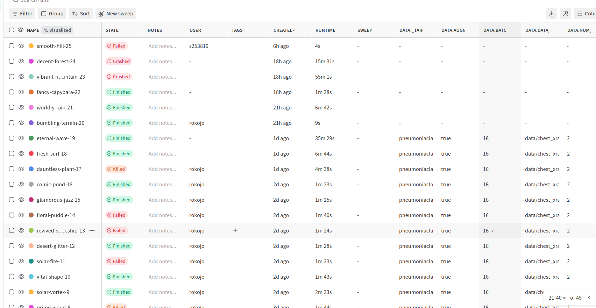
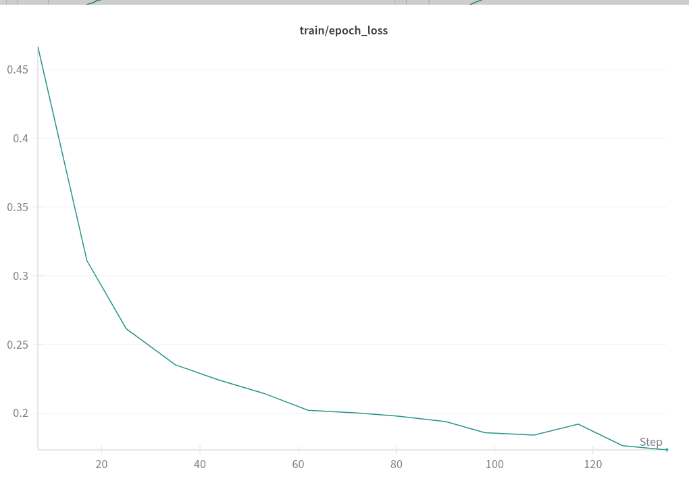
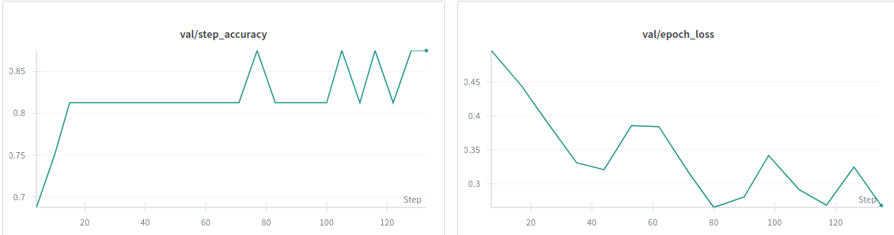
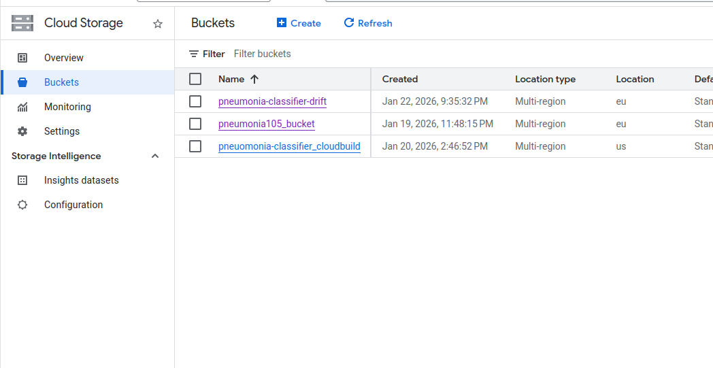
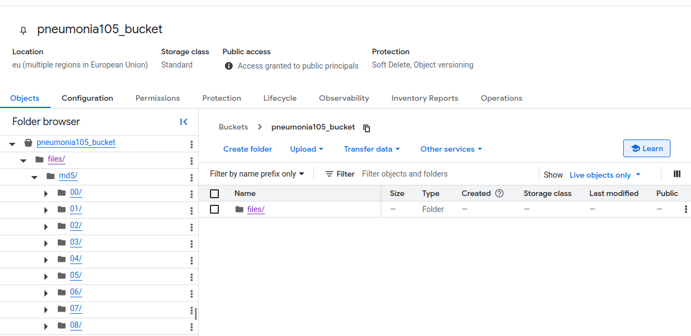
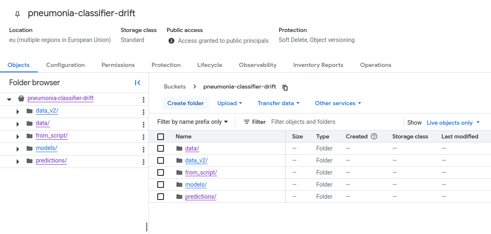
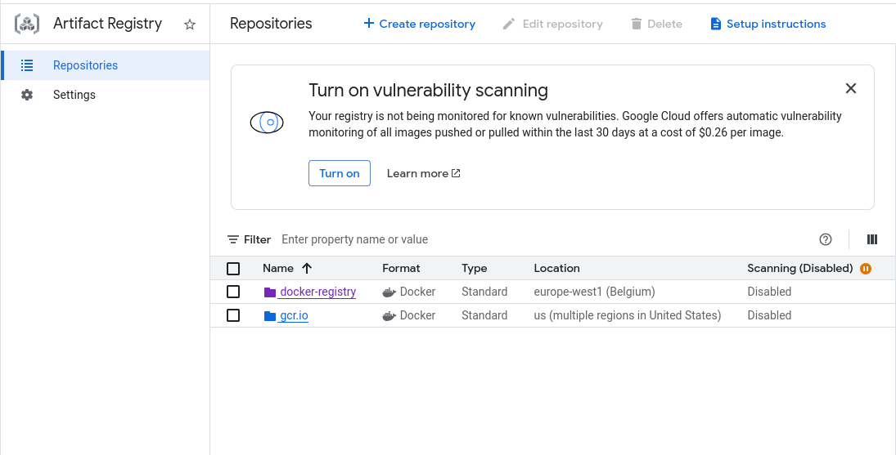
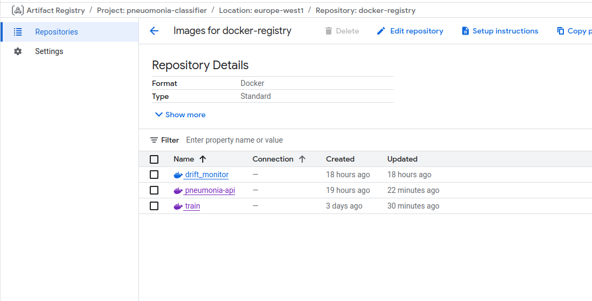
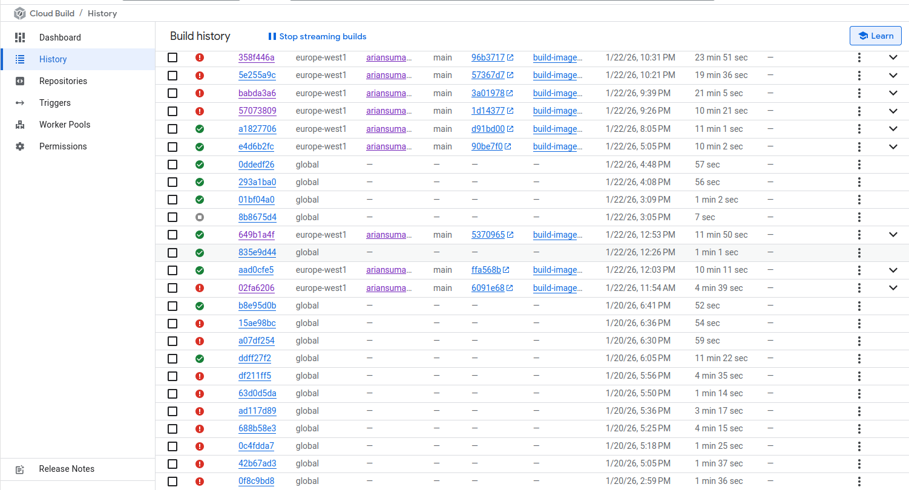
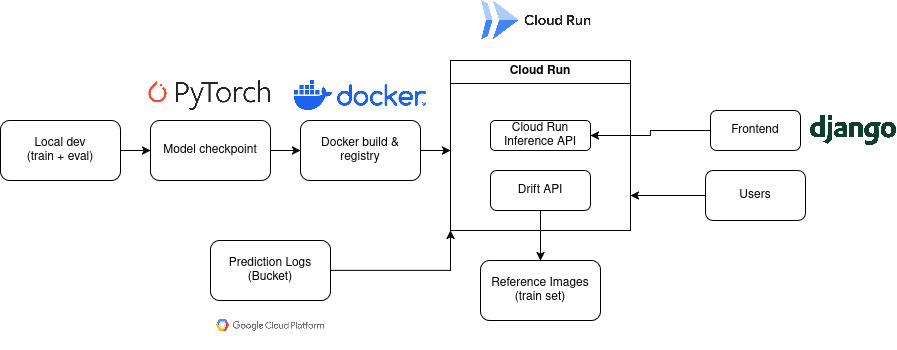

# Exam template for 02476 Machine Learning Operations

This is the report template for the exam. Please only remove the text formatted as with three dashes in front and behind
like:

```--- question 1 fill here ---```

Where you instead should add your answers. Any other changes may have unwanted consequences when your report is
auto-generated at the end of the course. For questions where you are asked to include images, start by adding the image
to the `figures` subfolder (please only use `.png`, `.jpg` or `.jpeg`) and then add the following code in your answer:

``

In addition to this markdown file, we also provide the `report.py` script that provides two utility functions:

Running:

```bash
python report.py html
```

Will generate a `.html` page of your report. After the deadline for answering this template, we will auto-scrape
everything in this `reports` folder and then use this utility to generate a `.html` page that will be your serve
as your final hand-in.

Running

```bash
python report.py check
```

Will check your answers in this template against the constraints listed for each question e.g. is your answer too
short, too long, or have you included an image when asked. For both functions to work you mustn't rename anything.
The script has two dependencies that can be installed with

```bash
pip install typer markdown
```

or

```bash
uv add typer markdown
```

## Overall project checklist

The checklist is *exhaustive* which means that it includes everything that you could do on the project included in the
curriculum in this course. Therefore, we do not expect at all that you have checked all boxes at the end of the project.
The parenthesis at the end indicates what module the bullet point is related to. Please be honest in your answers, we
will check the repositories and the code to verify your answers.

### Week 1

* [x] Create a git repository (M5)
* [x] Make sure that all team members have write access to the GitHub repository (M5)
* [x] Create a dedicated environment for you project to keep track of your packages (M2)
* [x] Create the initial file structure using cookiecutter with an appropriate template (M6)
* [x] Fill out the `data.py` file such that it downloads whatever data you need and preprocesses it (if necessary) (M6)
* [x] Add a model to `model.py` and a training procedure to `train.py` and get that running (M6)
* [x] Remember to either fill out the `requirements.txt`/`requirements_dev.txt` files or keeping your
    `pyproject.toml`/`uv.lock` up-to-date with whatever dependencies that you are using (M2+M6)
* [ ] Remember to comply with good coding practices (`pep8`) while doing the project (M7)
* [x] Do a bit of code typing and remember to document essential parts of your code (M7)
* [x] Setup version control for your data or part of your data (M8)
* [x] Add command line interfaces and project commands to your code where it makes sense (M9)
* [x] Construct one or multiple docker files for your code (M10)
* [x] Build the docker files locally and make sure they work as intended (M10)
* [x] Write one or multiple configurations files for your experiments (M11)
* [x] Used Hydra to load the configurations and manage your hyperparameters (M11)
* [ ] Use profiling to optimize your code (M12)
* [ ] Use logging to log important events in your code (M14)
* [x] Use Weights & Biases to log training progress and other important metrics/artifacts in your code (M14)
* [ ] Consider running a hyperparameter optimization sweep (M14)
* [ ] Use PyTorch-lightning (if applicable) to reduce the amount of boilerplate in your code (M15)

### Week 2

* [x] Write unit tests related to the data part of your code (M16)
* [x] Write unit tests related to model construction and or model training (M16)
* [x] Calculate the code coverage (M16)
* [x] Get some continuous integration running on the GitHub repository (M17)
* [x] Add caching and multi-os/python/pytorch testing to your continuous integration (M17)
* [ ] Add a linting step to your continuous integration (M17)
* [ ] Add pre-commit hooks to your version control setup (M18)
* [x] Add a continues workflow that triggers when data changes (M19)
* [x] Add a continues workflow that triggers when changes to the model registry is made (M19)
* [x] Create a data storage in GCP Bucket for your data and link this with your data version control setup (M21)
* [x] Create a trigger workflow for automatically building your docker images (M21)
* [x] Get your model training in GCP using either the Engine or Vertex AI (M21)
* [x] Create a FastAPI application that can do inference using your model (M22)
* [x] Deploy your model in GCP using either Functions or Run as the backend (M23)
* [x] Write API tests for your application and setup continues integration for these (M24)
* [x] Load test your application (M24)
* [x] Create a more specialized ML-deployment API using either ONNX or BentoML, or both (M25)
* [x] Create a frontend for your API (M26)

### Week 3

* [x] Check how robust your model is towards data drifting (M27)
* [x] Setup collection of input-output data from your deployed application (M27)
* [ ] Deploy to the cloud a drift detection API (M27)
* [x] Instrument your API with a couple of system metrics (M28)
* [x] Setup cloud monitoring of your instrumented application (M28)
* [x] Create one or more alert systems in GCP to alert you if your app is not behaving correctly (M28)
* [x] If applicable, optimize the performance of your data loading using distributed data loading (M29)
* [ ] If applicable, optimize the performance of your training pipeline by using distributed training (M30)
* [ ] Play around with quantization, compilation and pruning for you trained models to increase inference speed (M31)

### Extra

* [ ] Write some documentation for your application (M32)
* [ ] Publish the documentation to GitHub Pages (M32)
* [x] Revisit your initial project description. Did the project turn out as you wanted?
* [x] Create an architectural diagram over your MLOps pipeline
* [x] Make sure all group members have an understanding about all parts of the project
* [x] Uploaded all your code to GitHub

## Group information

### Question 1
> **Enter the group number you signed up on <learn.inside.dtu.dk>**

105


### Question 2
> **Enter the study number for each member in the group**

s252552, s253819, s253470, s254629


### Question 3
> **Did you end up using any open-source frameworks/packages not covered in the course during your project? If so**
> **which did you use and how did they help you complete the project?**

No, all frameworks used in this project are mentioned in the course's Github Pages.

## Coding environment

> In the following section we are interested in learning more about you local development environment. This includes
> how you managed dependencies, the structure of your code and how you managed code quality.

### Question 4

> **Explain how you managed dependencies in your project? Explain the process a new team member would have to go**
> **through to get an exact copy of your environment.**

We managed dependencies using uv, a modern Python package and environment manager that provides fast, reproducible dependency resolution and virtual environment handling.

All project dependencies are declared in the pyproject.toml file, which serves as the single source of truth for both runtime and development dependencies. From this file, uv automatically generates a lockfile (uv.lock), which pins exact package versions and transitive dependencies. This ensures that all team members use an identical dependency graph across machines.

To obtain an exact copy of the development environment, a new team member would follow these steps:

```bash
git clone git@github.com:ariansumak/MLOPS_105.git
cd MLOPS_105
uv sync                  #synchronize the environment
uv pip install -e .      # install the project in editable mode
```

### Question 5

> **We expect that you initialized your project using the cookiecutter template. Explain the overall structure of your **code. What did you fill out? Did you deviate from the template in some way?**

The project was initialized using the provided cookiecutter MLOps template, which defines a standardized structure for machine learning projects.

We filled out and actively used the following parts of the template:

* **src/** - Contains the core Python package for the project, including modules for data loading, model definition, training, evaluation, inference, and the FastAPI and BentoML services. We followed the recommended src-layout to ensure clean imports and reproducibility.

* **configs/** - Filled with Hydra configuration files, split by concern (data, model, optimizer, training, experiment, and inference). These configs allow us to compose experiments and override parameters from the command line without modifying source code.

* **dockerfiles/** - Contains the docker files for training and for the FastAPI service that exposes health and prediction endpoints and loads model + config.

* **tests/** - Implemented unit and integration tests, particularly for the API and data loading, which are run locally and in CI.

* **models/** - Contains the trained models checkpoints.

* **reports/** - Contains sample images of the dataset and statistics like class distribution across the different splits of the dataset and the dataset itself.

We have slightly deviated from the template, having removed the following directories:

* **data/** - The original data/ directory was intentionally removed from Git tracking and replaced by DVC-based data versioning. Large image datasets are not suitable for Git, so we use DVC to store the data in a remote bucket in  Google Cloud Platform while committing only the corresponding .dvc metadata files. This ensures that all team members can retrieve the exact same dataset using ``dvc pull``, without inflating the repository size.

### Question 6

> **Did you implement any rules for code quality and format? What about typing and documentation? Additionally,**
> **explain with your own words why these concepts matters in larger projects.**

We did not use automated linting or formatting tools, nor did we generate formal documentation with frameworks like Sphinx or MkDocs. Instead, we focused on **practical internal measures** to ensure code clarity and maintainability. We wrote several **Markdown files** explaining the functionality of different parts of the project, and we added **docstrings** to all functions to describe their purpose, parameters, and expected outputs.  

Additionally, we used **Python type hints** to specify input and output types for functions. For example, in `get_dataloaders`, we indicate that `data_dir` is a string, `batch_size` and `num_workers` are integers, `augment` is a boolean, and the function returns a tuple of three `DataLoader` objects.  

These practices are important in larger projects because they **reduce misunderstandings, prevent errors, and make it easier for team members to navigate the codebase**. For instance, type hints allow developers to quickly understand what kinds of inputs and outputs functions expect, and docstrings provide immediate context for how to use each function without reading the full implementation. Together, these practices improve **collaboration, reproducibility, and maintainability**.

## Version control

> In the following section we are interested in how version control was used in your project during development to
> corporate and increase the quality of your code.

### Question 7

> **How many tests did you implement and what are they testing in your code?**

In total, we implemented 13 tests. These primarily focus on the most critical components of the system: the FastAPI inference API, data loading pipeline, model construction, and training loop. The API tests validate endpoint availability, correct predictions, and proper error handling for invalid inputs. Data tests ensure correct batching and preprocessing behavior, while model and training tests verify output shapes, parameter freezing, and successful execution of a training epoch. Together, these tests provide confidence in both training and inference workflows.

### Question 8

> **What is the total code coverage (in percentage) of your code? If your code had a code coverage of 100% (or close**
> **to), would you still trust it to be error free? Explain you reasoning.**
>
> Recommended answer length: 100-200 words.
>
> Example:
> *The total code coverage of code is X%, which includes all our source code. We are far from 100% coverage of our **
> *code and even if we were then...*
>
> Answer:

The toal code coverage of code is 41%, which includes all our source code. We are far from 100% coverage of our source code, but even if we were that wouldn't mean it's error free. Especially since we tried to make our code for deployment cloud, and a lot of the errors were coming from permissions and lack of / wrong environment variables. Most of the tests are written using dummy data and testing the functions inside file, and a few api tests using locust.

### Question 9

> **Did you workflow include using branches and pull requests? If yes, explain how. If not, explain how branches and**
> **pull request can help improve version control.**

Yes, our development workflow made use of feature branches and pull requests. Instead of committing directly to the main branch, we created separate branches for distinct pieces of functionality such as API development (api_tasks, api_workflow), configuration management (configurations, pip2hydra), data handling (feat-dvc), CLI tooling (feat-CLI), containerization (docker, docker-image), continuous integration (continous-integration), and cloud deployment (gcp-init, cloud-deployment, drift_deploy).

Each branch allowed us to develop and test changes in isolation without breaking the stable main codebase. Once a feature or milestone was complete, the changes were merged back into main using pull requests. This process encouraged review of the changes, made it easier to track what was added for each milestone, and reduced the risk of introducing bugs.

Overall, using branches and pull requests improved collaboration, made the project history more understandable, and provided a safer workflow for integrating new features into the main branch.

### Question 10

> **Did you use DVC for managing data in your project? If yes, then how did it improve your project to have version**
> **control of your data. If no, explain a case where it would be beneficial to have version control of your data.**

We did make use of DVC to manage our dataset, which was hosted on Google Cloud Platform. Using DVC allowed us to track our data versions separately from the code, enabling us to reproduce experiments reliably and collaborate efficiently without having to store large files directly in Git. Each team member could pull the exact version of the dataset needed for training or evaluation using dvc pull, ensuring consistency across different environments.

Version control of data also helped us maintain a clear history of dataset updates, such as cleaning or preprocessing steps, and it simplified the integration of new data without breaking existing experiments. In addition, DVC’s ability to link specific code versions to particular dataset snapshots made it easy to reproduce results for reporting and debugging. Overall, DVC improved both reproducibility and collaboration, making our project workflow more robust and reliable.

### Question 11

> **Discuss you continuous integration setup. What kind of continuous integration are you running (unittesting,**
> **linting, etc.)? Do you test multiple operating systems, Python  version etc. Do you make use of caching? Feel free**
> **to insert a link to one of your GitHub actions workflow.**

Our project uses GitHub Actions for continuous integration (CI). 

We have organized our continuous integration setup into three main workflows: Check Staged Model, DVC Workflow, and Run Tests.

The Run Tests workflow is focused on verifying code correctness and cross-platform compatibility. It runs on three operating systems: Ubuntu (latest), Windows (latest), and macOS (latest). Each job performs a series of steps including setting up the environment, checking out the repository, setting up Python, installing dependencies, running tests with pytest, and then performing post-job cleanup tasks. This ensures that our code works consistently across different OS environments and Python versions. We also make use of caching for dependencies to speed up workflow execution.

The DVC Workflow is designed to maintain data integrity. It currently contains a single job, run_data_checker, which validates that our dataset is consistent and correctly versioned according to DVC standards.

The Check Staged Model workflow handles model deployment verification. It consists of three jobs: identify_event, test_model, and add_production_alias. This workflow ensures that any new model version passes validation before being promoted to production.

Our CI setup covers unit testing, data validation, and model verification, providing confidence in both code and data reliability. By separating concerns into distinct workflows, we can maintain modularity and clarity while running targeted checks efficiently.

An example of a triggered workflow can be seen here: https://github.com/ariansumak/MLOPS_105/actions/workflows/tests.yaml

## Running code and tracking experiments

> In the following section we are interested in learning more about the experimental setup for running your code and
> especially the reproducibility of your experiments.

### Question 12

> **How did you configure experiments? Did you make use of config files? Explain with coding examples of how you would**
> **run a experiment.**
>
> Recommended answer length: 50-100 words.
>
> Example:
> *We used a simple argparser, that worked in the following way: Python  my_script.py --lr 1e-3 --batch_size 25*
>
> Answer:

We configured experiments with Hydra config files in configs/, primarily main.yaml and inference.yaml. This lets us keep defaults in YAML and override parameters from the command line for quick experiments. For example, we can run a short CPU experiment with a different learning rate and epochs:

train.py train.epochs=1 train.device=cpu optimizer.lr=1e-3 wandb.enabled=false

This keeps experiments consistent and easy to reproduce.

### Question 13

> **Reproducibility of experiments are important. Related to the last question, how did you secure that no information**
> **is lost when running experiments and that your experiments are reproducible?**

To ensure reproducibility of our experiments, we relied on **Hydra configuration files** and **Weights & Biases (wandb)** logging. Hydra configs store all parameters related to an experiment, including data paths, model architecture, training hyperparameters, and inference settings. By using these config files, we can recreate any past experiment simply by re-running the training code with the same configuration.  

During training, we logged all metrics, losses, and model checkpoints using **wandb**, which allows us to track experiments over time and compare results easily. Each run is associated with its exact configuration and environment, preventing loss of information and enabling consistent reproduction of results.  

To reproduce an experiment, one would need to retrieve the corresponding Hydra config and run the training script with the same random seeds and environment setup. The combination of **structured configuration and systematic experiment tracking** ensures that our experiments are fully reproducible and results are never lost.


### Question 14

> **Upload 1 to 3 screenshots that show the experiments that you have done in W&B (or another experiment tracking**
> **service of your choice). This may include loss graphs, logged images, hyperparameter sweeps etc. You can take**
> **inspiration from [this figure](figures/wandb.png). Explain what metrics you are tracking and why they are**
> **important.**
>
> Recommended answer length: 200-300 words + 1 to 3 screenshots.
>
> Example:
> *As seen in the first image when have tracked ... and ... which both inform us about ... in our experiments.*
> *As seen in the second image we are also tracking ... and ...*
>
> Answer:


*Figure 1: W&B runs table showing multiple experiments with different outcomes and settings. This gives a quick
overview of completed vs failed runs and helps compare runtime, dataset, and augmentation settings across runs.*


*Figure 2: Training epoch loss decreases steadily, indicating the model is learning and the optimizer is converging.*


*Figure 3: Validation accuracy fluctuates around the low-to-high 0.8 range while validation loss trends downward with
some noise, which is typical for small validation sets and indicates generalization performance.*

Answer:
We track three main types of signals in W&B: training loss, validation accuracy, and validation loss. Training loss
shows how well the model fits the training data and whether optimization is converging; in our runs it decreases
steadily, which suggests stable learning. Validation accuracy is the primary metric for model quality on unseen data,
and the plot shows it rising and stabilizing in the low-to-high 0.8 range, which indicates improving generalization.
Validation loss complements accuracy by reflecting confidence and calibration; it trends downward but with some noise,
which is expected for limited validation batches. Finally, the runs table provides an experiment overview with run
status, runtime, and key settings, making it easy to compare configurations (e.g., data augmentation and batch size)
and identify runs that failed or crashed. These metrics together let us verify convergence, detect overfitting, and
select the most reliable checkpoint.

### Question 15

> **Docker is an important tool for creating containerized applications. Explain how you used docker in your**
> **experiments/project? Include how you would run your docker images and include a link to one of your docker files.**

For our project, we developed several Docker images to support **training, inference, and monitoring**. Each image is based on a lightweight Python 3.13 slim environment with essential build tools installed.  

The **training image** (`train.dockerfile`) installs dependencies, initializes DVC without SCM, and pulls the dataset at runtime. This ensures that training is fully reproducible across machines.  

The **backend API image** (`backend.dockerfile`) exposes endpoints via FastAPI for health checks and predictions, while separate images for the **API** (`api.dockerfile`) and **drift monitoring** (`drift_monitor.dockerfile`) serve their respective endpoints using Uvicorn.  

All Dockerfiles leverage **UV for dependency management** and caching to speed up builds, and **DVC for data versioning**, pulling the dataset only at runtime rather than at build time.  

An example Dockerfile can be seen here: [train.dockerfile](https://github.com/ariansumak/MLOPS_105/blob/main/dockerfiles/train.dockerfile)

### Question 16

When running into bugs during experiments, we primarily used **Python’s built-in debugger, `pdb`**, to step through the code and inspect the flow of execution. This allowed us to pause the program at specific points, examine variable values, and understand where the logic was failing. In addition, we frequently used **strategic print statements** to quickly check intermediate outputs and verify that data and model behavior matched our expectations. These combined methods were simple but effective for identifying issues in both data processing and model training.  

We did not perform formal code profiling due to time constraints, so we cannot claim that the code is fully optimized. While the code generally runs efficiently for our datasets and experiments, there are likely areas for improvement in memory usage and runtime performance. We recognize that profiling and performance tuning are important, especially in larger-scale experiments, and would be necessary for production deployments or processing larger d* [ ] Use logging to log important events in your code (M14)
atasets.  

Overall, our debugging approach focused on **clarity, understanding, and incremental problem-solving**, rather than assuming the code was perfect.


## Working in the cloud

> In the following section we would like to know more about your experience when developing in the cloud.

### Question 17

> **List all the GCP services that you made use of in your project and shortly explain what each service does?**
>
> Recommended answer length: 50-200 words.
>
> Example:
> *We used the following two services: Engine and Bucket. Engine is used for... and Bucket is used for...*
>
> Answer:

We used Buckets to store our data for the data drifting tasks and for data versioning control. Artifact Registry was used to store the built docker images. We used Cloud Build and Triggers for automatic build of docker images on every push to main branch, using workflow for Git Actions and a cloudbuild.yaml file. We used Vertex AI to run our docker image for training. Finally, Cloud Run was used for deployment of backend and data drifting services.

### Question 18

> **The backbone of GCP is the Compute engine. Explained how you made use of this service and what type of VMs**
> **you used?**
>
> Recommended answer length: 100-200 words.
>
> Example:
> *We used the compute engine to run our ... . We used instances with the following hardware: ... and we started the*
> *using a custom container: ...*
>
> Answer:

We never used Compute Engine directly. For training we setup a vertex_ai_train.yaml file that would configure the VMs and for deployment we used Cloud Run.

### Question 19

> **Insert 1-2 images of your GCP bucket, such that we can see what data you have stored in it.**
> **You can take inspiration from [this figure](figures/bucket.png).**
>
> Answer:




### Question 20

> **Upload 1-2 images of your GCP artifact registry, such that we can see the different docker images that you have**
> **stored. You can take inspiration from [this figure](figures/registry.png).**
>
> Answer:




### Question 21

> **Upload 1-2 images of your GCP cloud build history, so we can see the history of the images that have been build in**
> **your project. You can take inspiration from [this figure](figures/build.png).**
>
> Answer:



### Question 22

> **Did you manage to train your model in the cloud using either the Engine or Vertex AI? If yes, explain how you did**
> **it. If not, describe why.**
>
> Recommended answer length: 100-200 words.
>
> Example:
> *We managed to train our model in the cloud using the Engine. We did this by ... . The reason we choose the Engine*
> *was because ...*
>
> Answer:

<<<<<<< HEAD:reports/README_2.md

=======
We trained our model only using the Vertex AI, because we found it to be easier during the exercises. Once we had setup a docker image that would have everything necessary to run our training script, including wandb logging, all we had to do was write a yaml file for vertex_ai, which was pretty similar to the one given in exercises. We just injected our wandb api key as secret from gcp and it was set to go. It worked almost immediately, so we had no reason to tryout the Engine.
>>>>>>> 7048caa5838a7f4af5cadfc1cd8f1b76f0e27e14:reports/README.md

## Deployment

### Question 23

> **Did you manage to write an API for your model? If yes, explain how you did it and if you did anything special. If**
> **not, explain how you would do it.**

Yes, we implemented an API for our Pneumonia Classifier model using **FastAPI**. The API provides endpoints for **health checks** and **image prediction**, allowing users to interact with the model in a standardized way.  

We structured the API so that the model, preprocessing transforms, device, and configuration are **loaded once at startup** and stored in the application state. This ensures that subsequent requests can reuse these resources efficiently, improving performance. The `/predict` endpoint accepts image uploads, validates the file type, applies preprocessing, runs inference on the model, and returns the predicted label, confidence score, and class probabilities.  

Additionally, we implemented **background logging** of predictions, so that inference metadata is saved without blocking the main request, improving responsiveness. The API also includes **CORS middleware**, allowing requests from specified origins, and provides a **root endpoint** with information about available endpoints for easy navigation.  

To launch the service, we provide a **CLI command using Typer** that runs the FastAPI server with optional host and port arguments. This setup makes the API both user-friendly and production-ready. 

### Question 24

> **Did you manage to deploy your API, either in locally or cloud? If not, describe why. If yes, describe how and**
> **preferably how you invoke your deployed service?**
>
> Recommended answer length: 100-200 words.
>
> Example:
> *For deployment we wrapped our model into application using ... . We first tried locally serving the model, which*
> *worked. Afterwards we deployed it in the cloud, using ... . To invoke the service an user would call*
> *`curl -X POST -F "file=@file.json"<weburl>`*
>
> Answer:

We deployed the API locally and prepared it for cloud deployment. Locally, we run the FastAPI service with Uvicorn as
described in `README.md`, and it is accessible at `http://localhost:8000` with `/health` and `/predict` endpoints. We
also provide a BentoML service for packaging and serving the model, which makes it easier to containerize and run in
different environments. For cloud deployment, we build Docker images and deploy them to Cloud Run with environment
variables that enable GCS logging for prediction logs. The API is invoked with a standard multipart upload:
`curl -F "file=@/path/to/image.jpg" <service-url>/predict`. Every inference call logs a JSON record (local or GCS),
which is then used by the drift monitoring service. All runnable commands and configuration details are documented in
`README.md`.

### Question 25

> **Did you perform any unit testing and load testing of your API? If yes, explain how you did it and what results for**
> **the load testing did you get. If not, explain how you would do it.**
>
> Recommended answer length: 100-200 words.
>
> Example:
> *For unit testing we used ... and for load testing we used ... . The results of the load testing showed that ...*
> *before the service crashed.*
>
> Answer:
We performed unit testing using `pytest`, with tests in `tests/` covering core functionality such as data handling and
basic API behavior. These are executed locally with `uv run pytest tests/` and also run in CI to ensure consistent
behavior across environments. We also ran a Locust load test against the local API (`http://127.0.0.1:8000`) with a
single user. The run completed with 0 percent failures. The `/health` endpoint had a median latency around 5 ms
(average ~5 ms), while `/predict` had a median latency around 430 ms (average ~595 ms) with a 95th percentile around
1.7 s. Overall throughput was ~0.6 requests per second in this single-user configuration. These results show that the
API is responsive for health checks and that inference latency is dominated by model execution, which is expected.

### Question 26

> **Did you manage to implement monitoring of your deployed model? If yes, explain how it works. If not, explain how**
> **monitoring would help the longevity of your application.**
>
> Recommended answer length: 100-200 words.
>
> Example:
> *We did not manage to implement monitoring. We would like to have monitoring implemented such that over time we could*
> *measure ... and ... that would inform us about this ... behaviour of our application.*
>
> Answer:
Yes, we implemented monitoring via prediction logging and a drift detection service. Each `/predict` call logs a JSON
record containing the prediction, confidence, and extracted features. The drift API reads recent prediction logs and
compares them against a reference dataset (the training images) using Evidently metrics. This produces a drift report
in HTML/JSON and a summary indicating whether dataset drift is detected. The service can run locally or in the cloud
with GCS-backed logs and reference images. This monitoring helps detect data distribution shifts early, which is
critical for maintaining model performance over time and deciding when retraining is needed. The GCS loggs can be buggy and dont work perfectly - this is not a finished product.

## Overall discussion of project

> In the following section we would like you to think about the general structure of your project.

### Question 27

> **How many credits did you end up using during the project and what service was most expensive? In general what do**
> **you think about working in the cloud?**
>
> Recommended answer length: 100-200 words.
>
> Example:
> *Group member 1 used ..., Group member 2 used ..., in total ... credits was spend during development. The service*
> *costing the most was ... due to ... . Working in the cloud was ...*
>
> Answer:

In total we used 34$ as a group and most of it was spent on the cloud runs and deployment. Compute engine spent a lot of credits as it was running for a long time by accident (used in the exercises and left on). It was a very complex system and it was very confusing working with permissions and navigating through different products of the cloud. After some time it got easier as we got used to working with it.

### Question 28

> **Did you implement anything extra in your project that is not covered by other questions? Maybe you implemented**
> **a frontend for your API, use extra version control features, a drift detection service, a kubernetes cluster etc.**
> **If yes, explain what you did and why.**
>
> Recommended answer length: 0-200 words.
>
> Example:
> *We implemented a frontend for our API. We did this because we wanted to show the user ... . The frontend was*
> *implemented using ...*
>
> Answer:

We implemeted a frontend because it made it easier to navigate the inference of the model and allowed a preview of the data. It was also fairly simple to do due to some previous experience in that area.


### Question 29

> **Include a figure that describes the overall architecture of your system and what services that you make use of.**
> **You can take inspiration from [this figure](figures/overview.png). Additionally, in your own words, explain the**
> **overall steps in figure.**
>
> Recommended answer length: 200-400 words
>
> Example:
>
> *The starting point of the diagram is our local setup, where we integrated ... and ... and ... into our code.*
> *Whenever we commit code and push to GitHub, it auto triggers ... and ... . From there the diagram shows ...*
>
> Answer:



The architecture starts with local development, where we train and evaluate the PyTorch model on a workstation. The
training process produces a model checkpoint, which is the serialized state of the trained model. This checkpoint is
packaged into a Docker image using our Dockerfiles, including all dependencies, preprocessing steps, and configuration
needed to run inference. The image is then pushed to a container registry, making it portable and ready for deployment.

The Docker image is deployed to Google Cloud Run, a fully managed serverless platform. Inside Cloud Run, we host two
main services: (1) the inference API that exposes endpoints for predicting labels from new images, and (2) the drift
API that monitors data drift by comparing incoming data with reference training images. Users or a Django frontend can
send requests to the inference API. Prediction logs and evaluation outputs are stored in a GCP bucket for persistence
and monitoring, and the drift service reads these logs to generate reports.

The system is designed for reproducibility and scalability. Reference images for drift monitoring are stored in GCS and
downloaded by the drift service when needed, allowing continuous checks for shifts in input distributions. By combining
Docker, Cloud Run, PyTorch, and Evidently, the architecture ensures that training, deployment, inference, and
monitoring are standardized and maintainable. Overall, the figure illustrates a CI/CD style workflow, moving from local
development through containerization and deployment to production inference and monitoring.

### Question 30

> **Discuss the overall struggles of the project. Where did you spend most time and what did you do to overcome these**
> **challenges?**
>
> Recommended answer length: 200-400 words.
>
> Example:
> *The biggest challenges in the project was using ... tool to do ... . The reason for this was ...*
>
> Answer:

There was a lot of issues with the GPC functionality, due to the lack of logging and high complexity of some tasks. There were issues with the merges as many overlapped and it happened that multple times we had to solve many conflicts which would sometimes break the code. Wandb also created some issues when using the artifacts to load the model checkpoint and generally as not everyone could access and gain the permissions to the data there. Permissions were generally a big issue also in GCP since some team members couldnt be granted access to the bucket needed. 

When images are built on the cloud or using the docker image, it takes a lot of memmory and time so it was very hard to debug the issues and keep focus on such tasks.

### Question 31

> **State the individual contributions of each team member. This is required information from DTU, because we need to**
> **make sure all members contributed actively to the project. Additionally, state if/how you have used generative AI**
> **tools in your project.**
>
> Recommended answer length: 50-300 words.
>
> Example:
> *Student sXXXXXX was in charge of developing of setting up the initial cookie cutter project and developing of the*
> *docker containers for training our applications.*
> *Student sXXXXXX was in charge of training our models in the cloud and deploying them afterwards.*
> *All members contributed to code by...*
> *We have used ChatGPT to help debug our code. Additionally, we used GitHub Copilot to help write some of our code.*
> Answer:

Student s252552 has focused mostly on oranizational stuff and docker images and the report. He also created and took care of the repository structure. Student s254629 created the CLI, helped with the dv and created the monitoring. Student s253470 oversaw most of the GCP cloud operations and created the hydra configurations. He also created the dataloader  and dvc for the initial machine learning model. Student s253819 oversaw the api processes and created the machine learning model training and evaluation scripts, connected initially with wandb and created the version control setups. He also focused on the drif detection algorithms.

We all used generative AI in the shapes of codex and or ChatGPT/Gemini. It was mostly used for improving the code readibility and if someone was stuck at a task.
